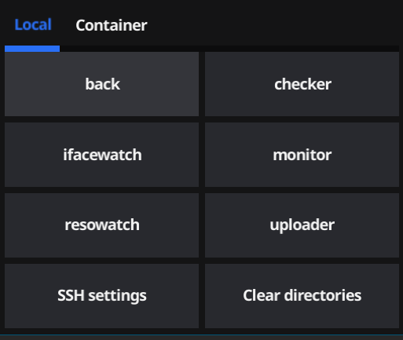

# Updater
Утилита,  предназначенная для оперативного обновления сервисов VMmanager

## GUI

## CLI

## Как установить
1. Загрузить artifacts.zip по [ссылке](https://gitlab-dev.ispsystem.net/team/vm/vm_custom_updater/-/artifacts).
2. Распаковать.

## Как обновить
0. Снести в ~/.config/updater/scripts/ все что хочешь обновить
1. Загрузить artifacts.zip по [ссылке](https://gitlab-dev.ispsystem.net/team/vm/vm_custom_updater/-/artifacts).
2. Распаковать.

## Инструкция GUI
1. Установить нужные зависимости
2. Запустить программу
3. Провести первоначальную настройку (кнопка SSH settings)
  - Пользовательские настройки из .ssh/config подхватываются автоматически.
    - Подключаясь к платформе командой ssh voronezh, можно указать только адрес: voronezh.
4. Выбрать режим:
  - Local - для разработчиков, позволяет загрузить локальные сборки.
  - Container - для всех, позволяет обновить из уже собранной в гитлабе бранчи.
5. Нажать на сервис
6. Ввести бранчу\выбрать папку с проектом
7. Подтвердить

## Инструкция CLI
0. Чтобы работало автодополнение в bash - надо ставить через `sudo install.sh`
1. Установить нужные зависимости
2. Запустить команду с флагом -h для получения дальнейших инструкций

## Зависимости
- Для разработчиков
  - sudo apt install rsync
- Для доступа по паролю (если настроен доступ по ключу - не требуется)
  - sudo apt install sshpass

## Полностью поддерживаемые сервисы

- vm_back
- monitor
- resowatch
- ifacewatch
- checker
_______________
[WIKI](https://gitlab-dev.ispsystem.net/team/vm/vm_custom_updater/-/wikis/home)
